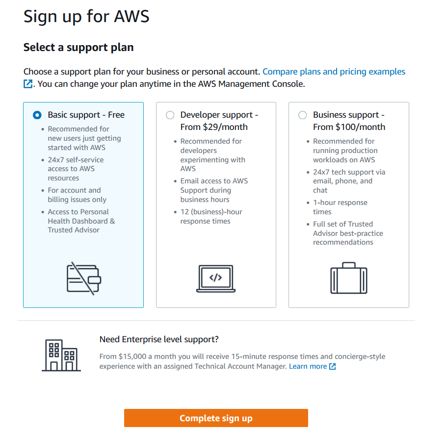
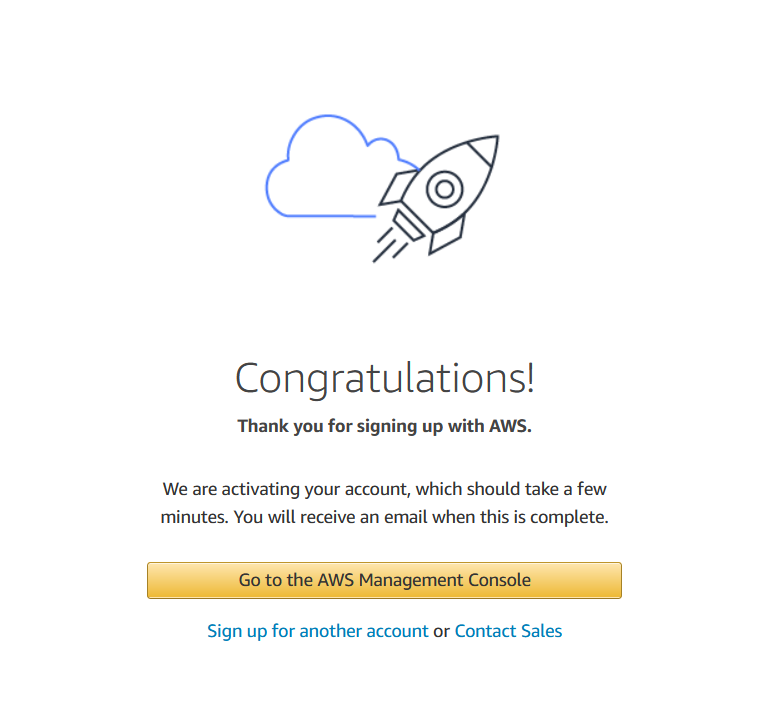
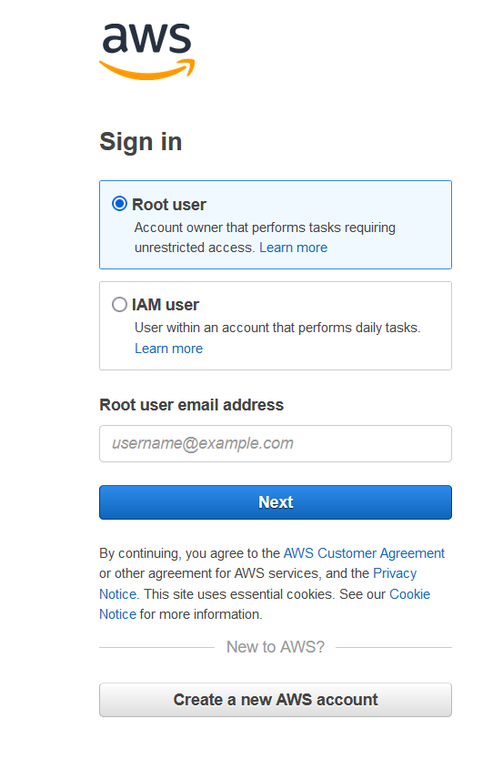

# Create your own AWS account

It is super easy to set up an AWS account (less than 10 mins), and it only charges 1 USD!!

In this tutorial, you are going to learn how to create an AWS account.

## What you need to have
1. Email address
2. Phone number
3. Billing address
4. Valid credit/debit card (with balance > 1 USD)

Ok, once everything is up, we're good to go!

## Procedure
1. Go to [AWS homepage](https://aws.amazon.com/?aws-products-analytics.sort-by=item.additionalFields.productNameLowercase&aws-products-analytics.sort-order=asc&aws-products-business-apps.sort-by=item.additionalFields.productNameLowercase&aws-products-business-apps.sort-order=asc&aws-products-containers.sort-by=item.additionalFields.productNameLowercase&aws-products-containers.sort-order=asc&aws-products-compute.sort-by=item.additionalFields.productNameLowercase&aws-products-compute.sort-order=asc&aws-products-databases.sort-by=item.additionalFields.productNameLowercase&aws-products-databases.sort-order=asc&aws-products-fe-mobile.sort-by=item.additionalFields.productNameLowercase&aws-products-fe-mobile.sort-order=asc&aws-products-game-tech.sort-by=item.additionalFields.productNameLowercase&aws-products-game-tech.sort-order=asc&aws-products-iot.sort-by=item.additionalFields.productNameLowercase&aws-products-iot.sort-order=asc&aws-products-ml.sort-by=item.additionalFields.productNameLowercase&aws-products-ml.sort-order=asc&aws-products-mgmt-govern.sort-by=item.additionalFields.productNameLowercase&aws-products-mgmt-govern.sort-order=asc&aws-products-migration.sort-by=item.additionalFields.productNameLowercase&aws-products-migration.sort-order=asc&aws-products-network.sort-by=item.additionalFields.productNameLowercase&aws-products-network.sort-order=asc&aws-products-security.sort-by=item.additionalFields.productNameLowercase&aws-products-security.sort-order=asc&aws-products-storage.sort-by=item.additionalFields.productNameLowercase&aws-products-storage.sort-order=asc
)
2. Click the **Create An AWS Account** orange button at top right corner.
3. Insert your 
    - Email address
    - Password
    - AWS account name(can be changed after sign up)
4. Insert your
    - Full name
    - Billing address
    - Phone number
5. Insert your
    - credit/debit card information 
    > (AWS will not charge for usage below AWS Free Tier limits. AWS temporarily hold $1 USD/EUR as a pending transaction for 3-5 days to verify your identity.)
6. Choose your plan
    > There are three options to choose: 
        - Basic support - Free (you can access to all AWS services within the limit of free tier for the next 12 months)
        - Developer support - $29/month
        - Business support - $100/month

7. Click complete sign up and you've now had an AWS account!
    
8. Click the **Go to the AWS Management Console** button in step 7.
9. You'll see a new page. Now, sign in as a Root user. Insert the email address you've just used to sign up the account.
    
10. Click **Next** and insert your password.
11. You will enter the AWS Management Console page.
    

**Congratulations!**

You'll have successfully created your AWS account. Now you can start doing experiment on AWS management console!

#### Useful Link
1. [How do I create and activate a new AWS account?](https://aws.amazon.com/premiumsupport/knowledge-center/create-and-activate-aws-account/)
2. [Setup AWS account - Step 1 - Create new AWS account](https://www.youtube.com/watch?v=gA9pl-A9gDM&list=PLIUhw5xEbE-UIt62T_qb8l-sf3eft5M4F)

